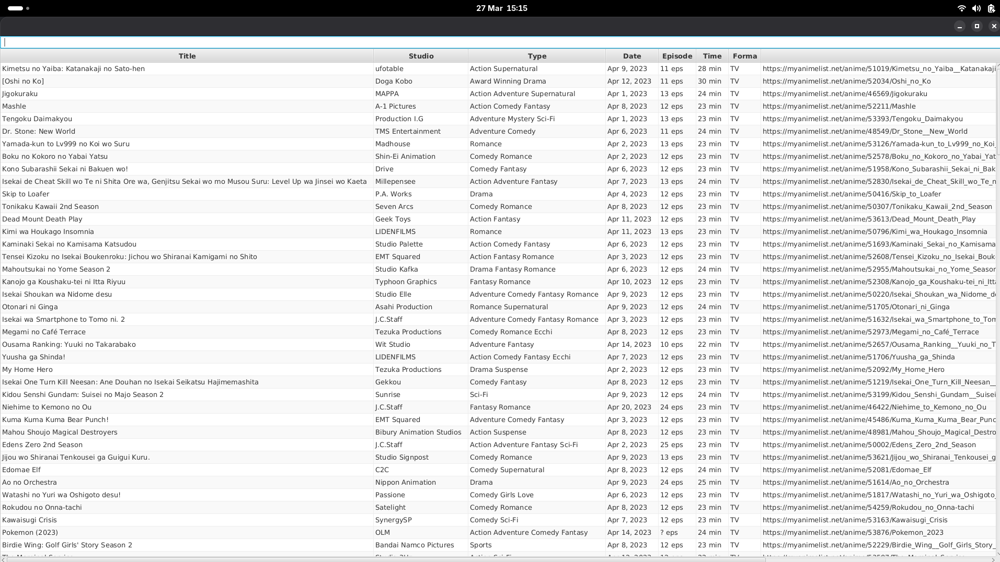
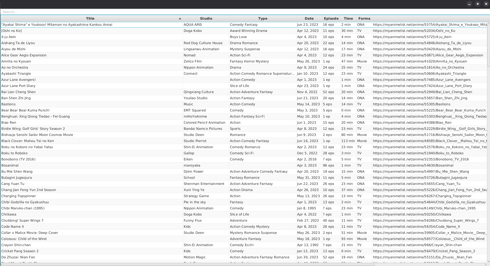
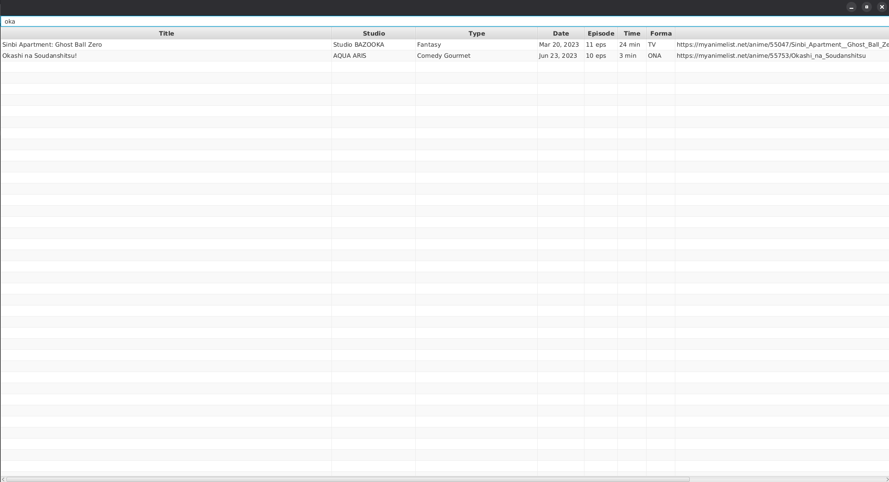

# AnimeTrackerFX

Desktop application built with JavaFX that displays seasonal anime data from MyAnimeList.

---

## Overview

AnimeTrackerFX is a simple JavaFX application that retrieves anime data from MyAnimeList using web scraping (JSoup) and displays it in a table.

The application allows browsing, sorting and filtering anime entries.

---

## Features

- fetching anime data from MyAnimeList
- displaying data using JavaFX TableView
- search and filtering
- column sorting
- basic error handling (network / HTTP)
- logging using Log4j

---

## Screenshots

### Main view



Data displayed as retrieved from MyAnimeList.

---

### Sorting



Sorting is done by clicking on column headers.

---

### Search



Filtering results using search input.

---

## Technologies

- Java 17
- JavaFX
- Maven
- JSoup
- Log4j

---

## Project structure

```
src/
 └── main/
     ├── java/com/example/jfx/
     │   ├── HelloApplication.java
     │   ├── HelloController.java
     │   ├── DataService.java
     │   └── DataObject.java
     └── resources/
         ├── log4j.xml
         └── log4j.properties
```

---

## How it works

1. JSoup connects to MyAnimeList
2. HTML is parsed into objects (`DataObject`)
3. Data is displayed in a TableView
4. User can filter results in real time

---

## Data source

The application currently uses a fixed seasonal URL:

```
https://myanimelist.net/anime/season/2023/spring
```

Changing the URL allows retrieving data for different years and seasons.

Available seasons:

- winter
- spring
- summer
- fall

Example:

```
https://myanimelist.net/anime/season/2024/winter
```

---

## Run

### IntelliJ

- open project as Maven
- set Java 17
- run `HelloApplication`

### Maven

```
./mvnw clean compile
./mvnw javafx:run
```

---

## Notes

- requires internet connection
- depends on website structure (scraping may break)
- JavaFX setup may require VM options

---

## Future improvements

- dynamic season and year selection
- GUI controls for choosing season
- opening anime links in browser
- asynchronous data loading
- data caching
- export to CSV

---

## Author

Hubert Jabłoński

